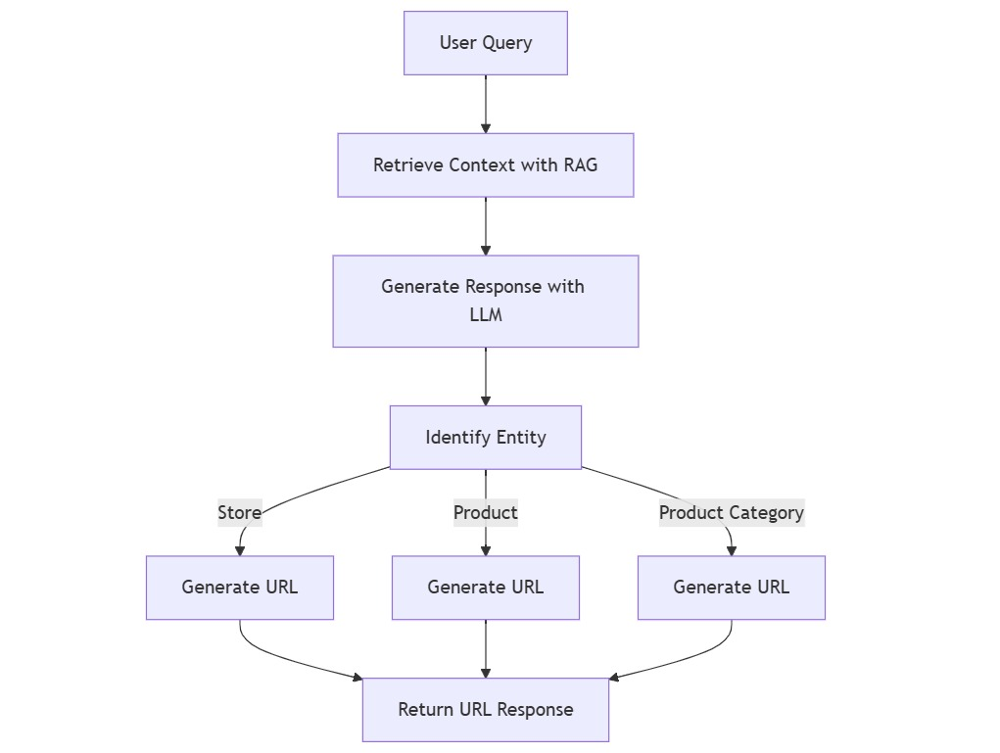
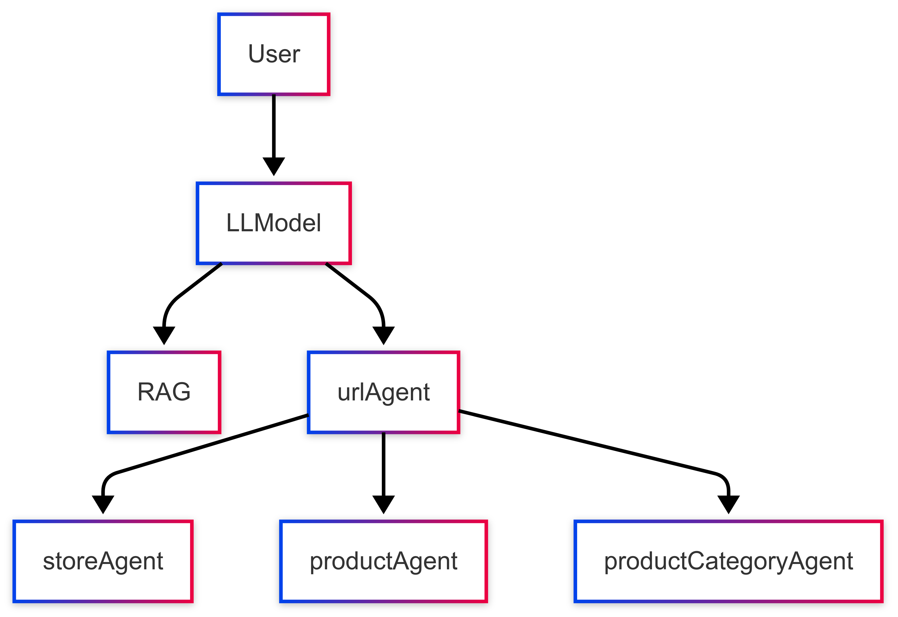
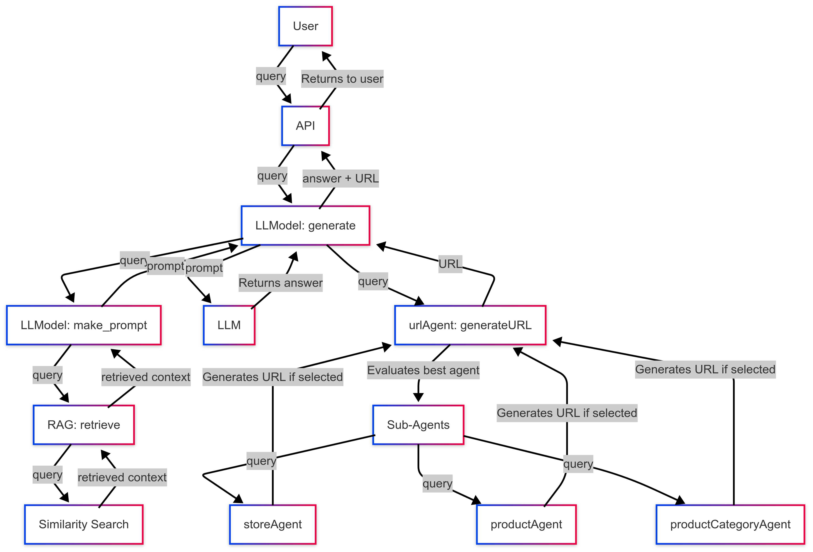

# UY AI Assistant console2.0

This repository contains a Flask-based AI assistant that helps users navigate and understand the ZE Manual interface by providing contextual responses and generating appropriate URLs.

## Overview

The system consists of several key components:
- **LLM-powered Response Generation**: Uses OpenAI's GPT models to generate helpful responses
- **Retrieval-Augmented Generation (RAG)**: Enhances responses with relevant context from documentation
- **URL Generation System**: Creates appropriate URLs based on user queries
- **Flask Web Server**: Provides an API endpoint for the frontend to communicate with

## Architecture



*Figure 1: The system processes user queries through context retrieval, response generation, entity identification, and URL generation to deliver comprehensive assistance.*

The system consists of these main components:
- `main.py`: Flask server entry point
- `LLModel.py`: Core LLM integration
- `RAG.py`: Retrieval-augmented generation functionality
- `url_agents/`: Directory containing various URL generation agents:
  - `urlAgent.py`: Main URL agent that coordinates between specialized agents
  - `productAgent.py`: Generates URLs for product-related operations
  - `productCategoryAgent.py`: Generates URLs for product category operations
  - `storeAgent.py`: Generates URLs for store-related operations

### Component Hierarchy



*Figure 2: The hierarchical structure of system components shows how the LLModel coordinates between RAG and URL generation agents.*

### Information Flow

For a more detailed view of how information flows through the system:



*Figure 3: Detailed information flow showing the complete request lifecycle, data transfers, and function calls between components.*

## Installation

1. Clone this repository:
```bash
git clone <repository-url>
cd <repository-directory>
```

2. Create and activate a virtual environment (recommended):
```bash
python -m venv venv
# On Windows
venv\Scripts\activate
# On macOS/Linux
source venv/bin/activate
```

3. Install dependencies:
```bash
pip install -r requirements.txt
```

4. Create a `.env` file in the root directory with your OpenAI API key:
```
OPENAI_API_KEY=your_openai_api_key_here
```

5. Create a `config.ini` file with your database connection details to connect the url_agent to the db:
```ini
[Database]
db_type = mysql
password = your_password
host = your_host
port = your_port
database = your_database
username = your_username
auth_plugin = mysql_native_password
```

6. Prepare your vector database:
   - Ensure you have the necessary documents in the `pdfs` directory
   - The system expects a Chroma vector database with collection name "ZE_Manual"

## Usage

1. Start the Flask server:
```bash
python main.py
```

2. The server will start on http://localhost:5000 by default

3. Send requests to the API endpoint:
```bash
curl -X POST http://localhost:5000/generate \
  -H "Content-Type: application/json" \
  -d '{"query": "How do I create a new product?"}'
```

4. The response will include both contextual information from the documentation and the appropriate URL (if available).

## API Reference

### Generate Response
- **URL**: `/generate`
- **Method**: `POST`
- **Body**:
  ```json
  {
    "query": "Your question or request here"
  }
  ```
- **Response**:
  ```json
  {
    "response": "Detailed response with instructions and URL if applicable"
  }
  ```

## Configuration

- Modify the `baseurl` in `main.py` to match your frontend URL
- Adjust model parameters in `LLModel.py` as needed
- Configure RAG parameters in `RAG.py` to tune retrieval

## Requirements

Dependencies are listed in `requirements.txt` and include:
- flask
- flask-cors
- openai
- langchain
- langchain-openai
- langchain-chroma
- langchain-community
- python-dotenv
- mysql-connector-python
- chromadb

## Contributing

Please follow these steps to contribute:
1. Fork the repository
2. Create a feature branch
3. Make your changes
4. Submit a pull request
